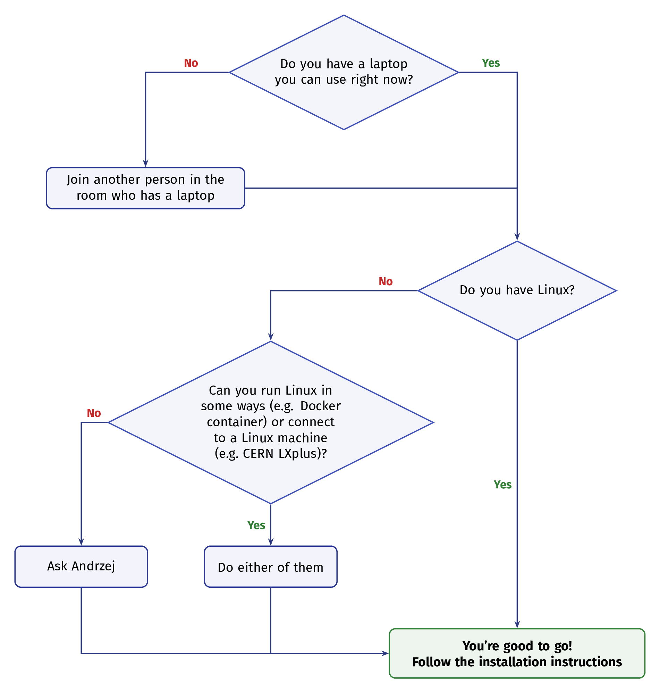

# Profiling with `perf` and Flamegraphs

**Hands-on exercises with MadGraph5_aMC@NLO and CUDACPP**

> In this exercise session, we will apply some of the profiling techniques discussed during the lectures to profile MadGraph5_aMC@NLO (MG5aMC) with the CUDACPP plugin for hardware-accelerated matrix element calculations. We will use Linux `perf` to collect various performance metrics, generate flamegraphs, and understand the differences between the original pure Fortran version of the code and the new version exploiting SIMD vector instructions. Finally, we will verify Amdahl's Law by observing the speedup.

📄 **PDF version**: download the formatted exercise sheet with fillable fields from the [latest release](../../releases/latest).

---

## Table of contents

- [1. Background](#1-background)
- [2. Prerequisites](#2-prerequisites)
  - [2.1 If you are using a Linux machine](#21-if-you-are-using-ayour-linux-machine)
  - [2.2 If you want to use the Docker image](#22-if-you-want-to-use-the-docker-image)
- [3. Exercise 1: Installation](#3-exercise-1-installation)
  - [3.1 Install MadGraph](#31-install-madgraph)
  - [3.2 Install the CUDACPP plugin](#32-install-the-cudacpp-plugin)
  - [3.3 Install the FlameGraph scripts](#33-install-the-flamegraph-scripts)
  - [3.4 Check your machine's vectorisation support](#34-check-your-machines-vectorisation-support)
- [4. Exercise 2: Generate a process and test the setup](#4-exercise-2-generate-a-process-and-test-the-setup)
  - [4.1 Generate the process](#41-generate-the-process)
  - [4.2 Run a first test](#42-run-a-first-test)
  - [4.3 Locate the madevent executable](#43-locate-the-madevent-executable)
- [5. Exercise 3: Prepare for profiling](#5-exercise-3-prepare-for-profiling)
  - [5.1 Add debug symbols and frame pointers](#51-add-debug-symbols-and-frame-pointers)
  - [5.2 Rebuild](#52-rebuild)
  - [5.3 Increase the number of events](#53-increase-the-number-of-events)
- [6. Exercise 4: Flamegraphs](#6-exercise-4-flamegraphs)
  - [6.1 A brief reminder on flamegraphs](#61-a-brief-reminder-on-flamegraphs)
  - [6.2 Profile the Fortran baseline](#62-profile-the-fortran-baseline)
  - [6.3 Profile the vectorised version](#63-profile-the-vectorised-version)
  - [6.4 Walking the stack: DWARF-based unwinding](#64-walking-the-stack-dwarf-based-unwinding)
- [7. Exercise 5: Amdahl's law verification](#7-exercise-5-amdahls-law-verification)
- [8. Exercise 6: Hardware performance counters](#8-exercise-6-hardware-performance-counters)
  - [8.1 General counters](#81-general-counters)
  - [8.2 Floating-point width counters](#82-floating-point-width-counters)
  - [8.3 How to interpret the results](#83-how-to-interpret-the-results)
- [9. Summary](#9-summary)
- [10. References and useful links](#10-references-and-useful-links)

---

## 1. Background

MadGraph5_aMC@NLO (MG5aMC) is a Monte Carlo event generator widely used in High Energy Physics and by the main LHC experiments. At its core, MG5aMC is a meta-code: given a certain physics process, it *writes* Fortran code that can be used to obtain physical events describing the specified process. This implies computing the corresponding scattering matrix elements, performing the phase space integration, and event unweighting, tasks that are done by the generated program **MadEvent**.

The **CUDACPP** plugin, developed at CERN, enhances the code generator engine, allowing it to write C++ code that can exploit SIMD vector instructions on CPUs or be offloaded to GPUs, replacing the Fortran matrix element calculation. The other parts of MadEvent (phase space, unweighting, …) stay unchanged.

The reason CUDACPP tackled the matrix element computation becomes clear when profiling the original Fortran code.

> **Trivia:** The name "MadGraph" comes from *Madison*, Wisconsin, where the code was originally created. It was born initially as a tool to automate Feynman diagram generation and matrix element calculation. It became a fully-fledged event generator once the component MadEvent was developed.

---

## 2. Prerequisites

Follow this decision tree to determine your setup:

<p align="center">
  
</p>

### 2.1 If you are using a/your Linux machine

If you are using LXplus or a CERN-based machine with access to CVMFS, you can get the needed software by loading the stack `LCG_108` for Alma Linux 9, built with GCC 14 with frame pointers enabled:

```bash
source /cvmfs/sft.cern.ch/lcg/views/LCG_108/x86_64-el9-gcc14fp-opt/setup.sh
```

Check that you have:
- Python 3.9 or more, with the `six` package
- GCC and GFortran
- GNU Make
- `perf` (if not available, install via `linux-tools-common`, `linux-tools-generic`, or `linux-tools-$(uname -r)` on Ubuntu/Debian)
- Perl (to generate FlameGraphs)

Before starting, check that `perf` works:

```bash
perf stat ls
```

### 2.2 If you want to use the Docker image

First, verify you have Docker installed, see the [official instructions](https://docs.docker.com/engine/install/).

A Docker image is provided with MadGraph, the CUDACPP plugin, the FlameGraph tools, and `perf` pre-installed:

```bash
docker pull ghcr.io/Qubitol/madgraph-profiling-exercises:latest
```

> **macOS / Apple Silicon users:** The Docker image works natively on Apple Silicon without x86 emulation. CUDACPP supports ARM NEON through the `cppsse4` backend, so **Mac users using the Docker image should use `cppsse4` as the backend when running MadGraph**.

#### Running the container

The tool `perf` accesses hardware performance counters through the host kernel, so the container must run with elevated privileges. There are two options.

**Option A: `--privileged` (simplest)**

```bash
docker run -it --rm \
  --privileged \
  --pid=host \
  ghcr.io/Qubitol/madgraph-profiling-exercises:latest
```

**Option B: fine-grained capabilities (more restrictive)**

```bash
docker run -it --rm \
  --cap-add SYS_ADMIN \
  --cap-add SYS_PTRACE \
  --security-opt seccomp=unconfined \
  --pid=host \
  ghcr.io/Qubitol/madgraph-profiling-exercises:latest
```

> ⚠️ **Host-side prerequisites:** The **host machine** must allow unprivileged access to performance counters. Check with `sysctl kernel.perf_event_paranoid`, it should return `-1`. If not:
> ```bash
> sudo sysctl kernel.perf_event_paranoid=-1
> ```

#### What is inside the container

| Component | Location |
|---|---|
| MadGraph5 | `~/MadGraph5/` |
| CUDACPP plugin | `~/MadGraph5/PLUGIN/` |
| FlameGraph scripts | `/opt/FlameGraph/` (also in `PATH`) |
| `perf` | `/usr/bin/perf` |

#### Verifying the setup

Once inside the container, run:

```bash
./check_perf.sh
```

#### Extracting files from the container

```bash
# From the host, while the container is running:
docker cp <container_id>:/home/user/path/to/flamegraph.svg .

# Or mount a volume when starting:
docker run -it --rm --privileged --pid=host \
  -v $(pwd)/output:/home/user/output \
  ghcr.io/Qubitol/madgraph-profiling-exercises:latest
```

---

## 3. Exercise 1: Installation

### 3.1 Install MadGraph

```bash
wget https://github.com/mg5amcnlo/mg5amcnlo/archive/refs/tags/v3.6.6.tar.gz
tar xzf v3.6.6.tar.gz
mv mg5amcnlo-3.6.6 MadGraph5
cd MadGraph5
```

Every subsequent command assumes you are inside the `MadGraph5` directory. Run it with:

```bash
./bin/mg5_aMC
```

### 3.2 Install the CUDACPP plugin

Install through the MadGraph CLI:

```bash
./bin/mg5_aMC <<EOF
install cudacpp
EOF
```

Or open MadGraph, run `install cudacpp`, and wait for it to finish. The plugin will be placed in the `PLUGIN/` directory.

### 3.3 Install the FlameGraph scripts

```bash
cd ..
git clone https://github.com/brendangregg/FlameGraph.git
export FLAMEGRAPH_DIR=$(pwd)/FlameGraph
cd MadGraph5
```

### 3.4 Check your machine's vectorisation support

Before choosing a CUDACPP backend, check which SIMD instruction sets your CPU supports:

```bash
grep -o -E 'sse4_2|avx2|avx512f|avx512bw|avx512vl' /proc/cpuinfo
```

The output tells you which backends you can use:
- `sse4_2` → backend `cppsse4` (128-bit, 2 doubles per instruction)
- `avx2` → backend `cppavx2` (256-bit, 4 doubles per instruction)
- `avx512f` + `avx512bw` + `avx512vl` → backends `cpp512y` or `cpp512z` (8 doubles per instruction)

> **✅ Exercise 1:** Install MadGraph, the CUDACPP plugin, and the FlameGraph tools. Verify that `perf` works. Check which SIMD instruction sets your machine supports and decide which backend you will use.

---

## 4. Exercise 2: Generate a process and test the setup

### 4.1 Generate the process

We will use the process gg → tt̄gg (gluon annihilation into a top–antitop pair with two additional gluons). This process has many Feynman diagrams, making the matrix element calculation computationally expensive and therefore an interesting profiling target.

Start MadGraph:

```bash
./bin/mg5_aMC
```

And run the following commands, one at a time:

```
generate g g > t t~ g g
output madevent_simd MY_PROCESS
```

The first command generates all the possible Feynman diagrams, while the second one *writes the code* needed to perform the event generation. A new folder named `MY_PROCESS` will appear in the current working directory.

> **Output modes:** `madevent_simd` enables CPU backends (`cppnone`, `cppsse4`, `cppavx2`, `cpp512y`, `cpp512z`). `madevent_gpu` enables GPU backends (CUDA, HIP).

### 4.2 Run a first test

Restart MadGraph if you closed it, and run the following commands (replace `cppavx2` with the appropriate backend):

```
launch MY_PROCESS
done
set cudacpp_backend cppavx2
set nevents 10000
```

The `done` command skips the first prompt. The `set` command is used in the second prompt to modify `run_card.dat` parameters.

If this completes without errors and produces a cross-section result, your setup is working.

### 4.3 Locate the madevent executable

MadGraph creates one `madevent` executable per subprocess:

```bash
cd MY_PROCESS/SubProcesses/P1_gg_ttxgg/
ls -la madevent
```

The `madevent` file is a symlink to the actual compiled binary (e.g. `madevent_cpp` for the vectorised backend). The first launch also creates subdirectories `G1/`, `G2/`, …, each containing an `input_app.txt` file with the parameters for a specific phase-space parametrisation.

Test running `madevent` directly:

```bash
./madevent < G1/input_app.txt
```

The code is instrumented with a timer, and will show the time spent in the Fortran overhead, in the matrix element, and the total time.

> **✅ Exercise 2:** Generate the gg → tt̄gg process, launch it once to verify the setup, and then run the `madevent` executable directly from the subprocess directory.

---

## 5. Exercise 3: Prepare for profiling

### 5.1 Add debug symbols and frame pointers

By default, the MadGraph build system does not provide debug symbols or frame pointers. Frame pointers are needed for `perf` to build a proper call stack.

We need to modify two files.

#### Fortran compilation flags

Edit `Source/make_opts` (from the root of `MY_PROCESS`) and change the `GLOBAL_FLAG` line:

```diff
# Original:
- GLOBAL_FLAG=-O
# Change to:
+ GLOBAL_FLAG=-O2 -g -fno-omit-frame-pointer
```

#### C++ and CUDA compilation flags

Edit `SubProcesses/P1_gg_ttxgg/cudacpp.mk` and modify the following lines.

Change `CXXFLAGS`:

```diff
# Original:
- CXXFLAGS = $(OPTFLAGS) -std=c++17 -Wall -Wshadow -Wextra
# Change to:
+ CXXFLAGS = $(OPTFLAGS) -std=c++17 -Wall -Wshadow -Wextra -O2 -g -fno-omit-frame-pointer
```

Change `OPTFLAGS`:

```diff
# Original:
- OPTFLAGS = -O3
# Change to:
+ OPTFLAGS = -O2 -g -fno-omit-frame-pointer
```

> ⚠️ **AMD GPU users:** There is an additional `override OPTFLAGS` that should be updated similarly.

> **Are these flags passed also to GPU builds?** Yes, the `OPTFLAGS` variable is forwarded to the host compiler `g++` via `nvcc`'s `-Xcompiler` flag in the Makefile, so modifying `OPTFLAGS` is sufficient.

### 5.2 Rebuild

Clean and rebuild from the `SubProcesses/P1_gg_ttxgg/` directory:

```bash
make cleanall
make madevent_cpp_link       # build the C++ vectorised version
make madevent_fortran_link   # build also the Fortran-only version
```

### 5.3 Increase the number of events

Profiling with a sampling profiler requires collecting enough samples. At 97 Hz, a 1-second run yields only ~97 samples, too few for a meaningful flamegraph.

Edit `G1/input_app.txt` and increase the number of events to at least **100,000** for CPU runs (the first integer in the first line), and **1,000,000** for GPU runs:

```
100000 1 1 !Number of events and max and min iterations
0.1        !Accuracy
2          !Grid Adjustment 0=none, 2=adjust
1          !Suppress Amplitude 1=yes
0          !Helicity Sum/event 0=exact
1
```

> **✅ Exercise 3:** Modify the compilation flags, rebuild both versions, increase the event count, and verify that both binaries run correctly and don't finish instantly.

---

## 6. Exercise 4: Flamegraphs

### 6.1 A brief reminder on flamegraphs

Flamegraphs are a visualisation of profiling data invented by Brendan Gregg. Each horizontal bar represents a function in the call stack. The **y-axis** is the stack depth (entry point at the bottom, leaf functions at the top). The **x-axis** is sorted alphabetically to merge identical stacks; the **width** of each bar is proportional to the number of samples in which that function appeared.

The workflow:
1. **Record**: use `perf record` to collect stack samples
2. **Collapse**: convert the raw stack traces into a folded format
3. **Render**: generate an interactive SVG

### 6.2 Profile the Fortran baseline

From the subprocess directory (`SubProcesses/P1_gg_ttxgg/`):

**Record:**

```bash
perf record --call-graph=fp,1024 -F 97 -- ./madevent_fortran < G1/input_app.txt
```

> `--call-graph=fp,1024` tells `perf` to use frame pointers to rebuild the stack. The numeric parameter is the maximum stack depth.

**Collapse:**

```bash
perf script | $FLAMEGRAPH_DIR/stackcollapse-perf.pl > fortran.folded
```

**Render:**

```bash
$FLAMEGRAPH_DIR/flamegraph.pl fortran.folded > flamegraph_fortran.svg
```

> **Why 97 Hz?** We use a prime number for the sampling frequency to avoid aliasing with periodic patterns in the code. If the code has a loop that takes exactly 10 ms per iteration, sampling at 100 Hz would always land at the same point in the loop.

Open `flamegraph_fortran.svg` in a web browser. The SVG is interactive: hover over bars to see function names and sample percentages, click to zoom, or search for functions.

> **✅ Exercise 4a:** Generate the flamegraph for the Fortran baseline. Identify the function that has been sampled the most: this is the current bottleneck. Note its name and the percentage of total samples it accounts for. Also note the total wall-time from the standard output.

### 6.3 Profile the vectorised version

```bash
perf record --call-graph=fp,1024 -F 97 -- ./madevent_cpp < G1/input_app.txt
perf script | $FLAMEGRAPH_DIR/stackcollapse-perf.pl > cpp.folded
$FLAMEGRAPH_DIR/flamegraph.pl cpp.folded > flamegraph_cpp.svg
```

> **✅ Exercise 4b:** Generate the flamegraph for the vectorised version. Compare it visually with the Fortran flamegraph. What happened to the bottleneck function? Which functions are now proportionally more visible? Note the new percentage and wall-time.

### 6.4 Walking the stack: DWARF-based unwinding

An alternative stack-walking method using debug unwind tables:

```bash
perf record --call-graph=dwarf -F 97 -- ./madevent_fortran < G1/input_app.txt
```

This works even without frame pointers but produces larger `perf.data` files.

---

## 7. Exercise 5: Amdahl's law verification

Amdahl's law predicts the maximum overall speedup when only a fraction of the workload is accelerated:

$$S_{\text{Amdahl}} = \frac{1}{(1 - p) + \frac{p}{n}}$$

where *p* is the fraction of runtime that can be parallelised and *n* is the number of processors you are parallelising over.

From the wall-clock times of both runs, compute:
- *T*<sub>Fortran</sub>: total time for the Fortran run
- *T*<sub>SIMD</sub>: total time for the vectorised run
- *S*<sub>observed</sub> = *T*<sub>Fortran</sub> / *T*<sub>SIMD</sub>

> **✅ Exercise 5:**
> 1. Assign *p*, *s*, *n* according to the vectorisation level chosen.
> 2. Compute *S*<sub>observed</sub> from the wall-clock times.
> 3. Verify Amdahl's law: does *S*<sub>Amdahl</sub> match *S*<sub>observed</sub>?
> 4. Is the speedup smaller/larger than what you expect? Why?
> 5. What would happen if *n* → ∞? What is the theoretical maximum speedup?

---

## 8. Exercise 6: Hardware performance counters

### 8.1 General counters

Run the following for both versions:

```bash
perf stat -e task-clock,cycles,instructions,cache-misses,cache-references,L1-dcache-load-misses \
    -- ./madevent_fortran < G1/input_app.txt
```

```bash
perf stat -e task-clock,cycles,instructions,cache-misses,cache-references,L1-dcache-load-misses \
    -- ./madevent_cpp < G1/input_app.txt
```

> **Counter multiplexing:** If you request more events than physical counter registers (typically 4–8), `perf` time-shares them. This is indicated by a percentage in parentheses, e.g. `(55.56%)`. For long, stable workloads, the extrapolation is reliable.

### 8.2 Floating-point width counters

These counters reveal *how* the CPU executes floating-point operations. We keep `task-clock` in the event list so that `perf stat` can compute human-readable derived metrics.

```bash
perf stat -e task-clock,<FP_SCALAR>,<FP_128>,<FP_256>,<FP_512> \
    -- ./madevent_fortran < G1/input_app.txt
```

Replace the placeholders with appropriate counter names. Check with:

```bash
perf list floating
```

Look for keywords like `packed`, `sse`, `avx`, `retired`.

| Width | Example counter name |
|---|---|
| Scalar | `fp_arith_inst_retired.scalar_double` |
| 128-bit | `fp_arith_inst_retired.128b_packed_double` |
| 256-bit | `fp_arith_inst_retired.256b_packed_double` |
| 512-bit | `fp_arith_inst_retired.512b_packed_double` |
| Scalar | `fp_ops_retired_by_width.scalar_uops_retired` |
| 128-bit | `fp_ops_retired_by_width.pack_128_uops_retired` |
| 256-bit | `fp_ops_retired_by_width.pack_256_uops_retired` |
| 512-bit | `fp_ops_retired_by_width.pack_512_uops_retired` |

### 8.3 How to interpret the results

> **✅ Exercise 6:** Collect the counters for both versions and answer:
> 1. Is the IPC lower or higher in the vectorised version? Why?
> 2. Is the cache miss *rate* lower/higher? Why?
> 3. What about the absolute number of cache misses?
> 4. Is there something weird in the FP width counters for the Fortran-only version? (Hint: it's supposed to be scalar…)
> 5. For the vectorised version, which width dominates? Is this consistent with your chosen backend?

---

## 9. Summary

In this session we covered:

- **Understand the code** by downloading MadGraph and doing some simple runs
- **Instrument the build** for profiling (debug symbols, frame pointers).
- **Record** stack samples with `perf record` and counters with `perf stat`.
- **Visualise** call stacks with flamegraphs.
- **Identify** the bottleneck and quantify its weight, and using Amdahl's law to predict the speedup.
- **Iterate** once the bottleneck is addressed, the next one emerges.

A key takeaway is that profiling is an iterative process.
Profiling again at the end of any kind of optimisation work is essential to be able to understand what actually changed, if performances have improved, and whether new bottlenecks have appeared.

> **What about GPUs?** When the matrix element computation is offloaded to GPU, CPU-only profilers like `perf` can no longer see the offloaded computation. The CPU flamegraph will show time spent in CUDA runtime calls (e.g. `cudaDeviceSynchronize`) rather than in the code itself. To profile GPU workloads, tools like NVIDIA **Nsight Systems** and **Nsight Compute** are needed. These are covered in the GPU lecture.

---

## 10. References and useful links

- Stephan Hageböck et al., *Data-parallel leading-order event generation in MadGraph5_aMC@NLO*: [arXiv:2507.21039](https://arxiv.org/abs/2507.21039)
- Andrea Valassi et al., *Madgraph on GPUs and vector CPUs: Towards production. The 5-year journey to the first LO release CUDACPP v1.00.00*: [arXiv:2503.21935](https://arxiv.org/abs/2503.21935)
- MadGraph5_aMC@NLO collaboration, *MadGraph5_aMC@NLO source repository*: https://github.com/mg5amcnlo/mg5amcnlo
- MadGraph4GPU collaboration, *MadGraph4GPU source repository*: https://github.com/madgraph5/madgraph4gpu
- *perf wiki -- Tutorial*: https://perf.wiki.kernel.org/index.php/Tutorial
- Brendan Gregg, *Flame Graphs*: https://www.brendangregg.com/flamegraphs.html
- Brendan Gregg, *FlameGraph tools*: https://github.com/brendangregg/FlameGraph
